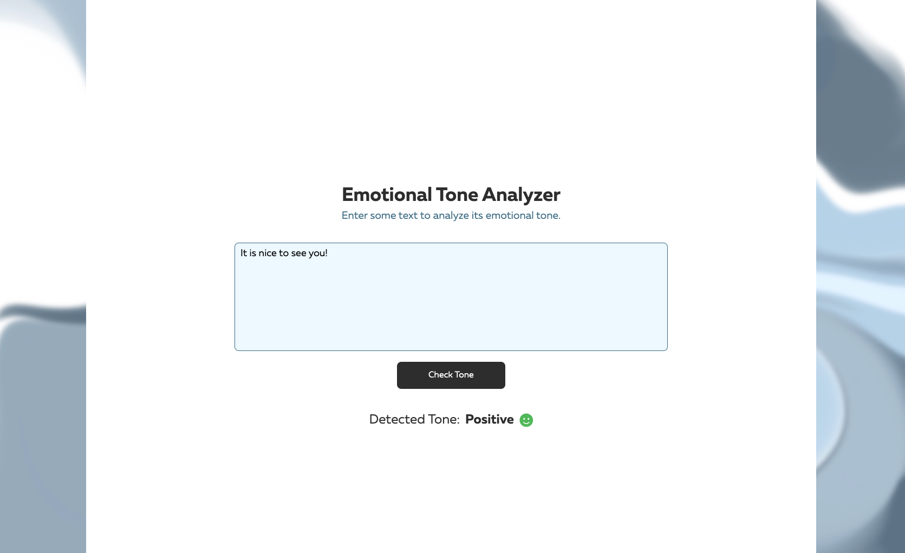

# Emotional Tone Analyzer 🔎

## Project description



Created application presents a tool that allows users to write down any phrase/text and get information about its emotional tone. That means, the app is made to help distinguish the presence of positive and negative emotions in written text.

The AI 'core' of the current project is  that provides natural language understanding technologies (such as the one used in the project - sentiment analysis). The application supports various languages (e.g. English, German e.t.c).

Emotional Tone Analyzer is a browser app which consists of:
1. Heading and description.
2. Text input field where text can be directly typed or pasted.
3. "Check Tone" button (or "Enter" key) to send a request to server.
4. Pop-up text showing a result of an analysis.
5. Dynamic error notifications.

Emotional Tone Analyzer is able to understand and visualize three types of emotional tone - 'Positive', 'Negative' and 'Neutral'. The result depends on a sentiment score received form AI API:

```
interface SentimentResponse {
    documentSentiment: {
        score: number;
    };
}
```

> Sentiment score can be between -1.0 (negative sentiment) and 1.0 (positive sentiment).


The app itself is adaptive, functional and can be used for its purpose.

**Note that the valid API-key is already integrated into the **


## How to get started

Step 1: Download (and unzip, if necessary) **JB-EmotionalToneAnalyzer.zip**.

Step 2: Open the project folder.

Step 3: Run `npm install` in the folder (terminal).

Step 4: Run `npm run start`.

Step 5: Open [localhost](http://localhost:3000/) in Chrome.

Step 6: Enjoy! 


